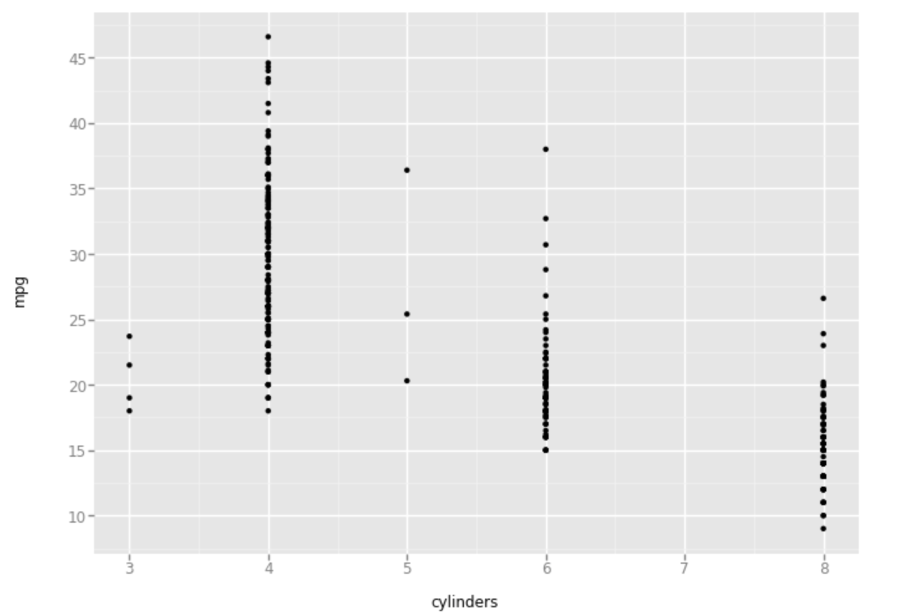

# Python Machine Learning

## Link to the Lab exercise
Link to the lab tutorial [click here](http://www.science.smith.edu/~jcrouser/SDS293/labs/python-intro.html)

> Write python machine learning program to analyze Auto.csv data.

* Write python program to analyze data and do Machine Learning
* Writing codes, visualization for python learning.

#### *1. Import python libraries*

import the following python libraries

```python    
import numpy as np
import pandas as pd
from ggplot import *
```

#### *2. Data Visualization*

```python    
ggplot(Auto, aes(x="cylinders", y="mpg")) + geom_point()
```
This will output the following scatter plot:

<!--  -->

<p align="center">
  
</p>

#### *3. Add new section here*


Thanks for reading!!!
